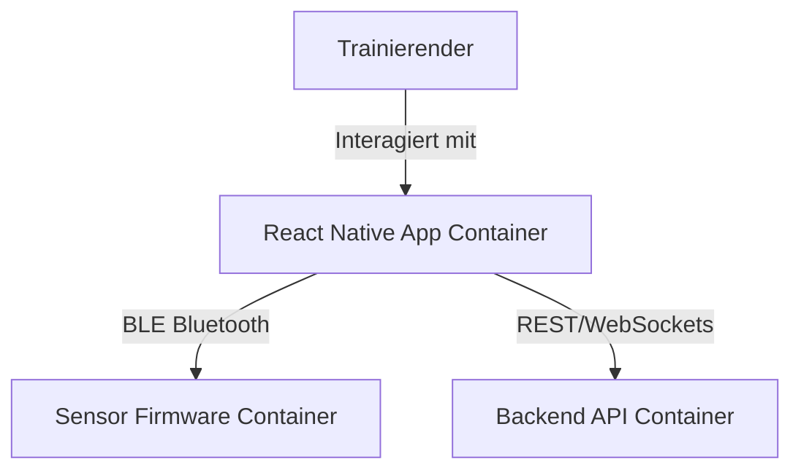

# MoveLink Mobile App - Container-Architektur

Dieses Dokument beschreibt die Mobile App als eigenständige, deploybare Einheit im C4-Modell.

## C4-Architektur-Ebene
* **C4-Ebene:** Container
* **Deployable:** Ja
* **Deployment-Artefakt:** Android Package (.apk) / iOS IPA
* **Technologie-Stack:** React Native, Expo, TypeScript, Zustand, BLE PLX

## Beschreibung
Die MoveLink Mobile App ist die primäre Benutzerschnittstelle des Systems. Sie läuft auf Android- und iOS-Endgeräten und verbindet sich über Bluetooth Low Energy (BLE) mit dem embedded Sensor-Gerät, um Bewegungsdaten in Echtzeit zu erfassen, zu visualisieren und zur persistenten Speicherung an das Backend zu übertragen.

## Komponenten in diesem Container
Die App enthält mehrere Komponenten (C4-Komponenten-Ebene):
1. **SideNav**: Navigationskomponente für die App-Steuerung. (Erfüllt: FA1)
2. **SensorCard**: Verwaltung der BLE-Geräteverbindung und Pairing. (Erfüllt: FA2, FA3, NF3)
3. **LiveChart**: Echtzeit-Visualisierung der IMU-Beschleunigungs- und Gyroskopwerte. (Erfüllt: FA6)
4. **SessionCard**: Visualisierung historischer Trainingseinheiten. (Erfüllt: FA7)
5. **BLE-Hook (useBLE)**: Kapselt die Bluetooth-Gerätekommunikation und den Reconnect. (Erfüllt: FA3, FA5, NF2)
