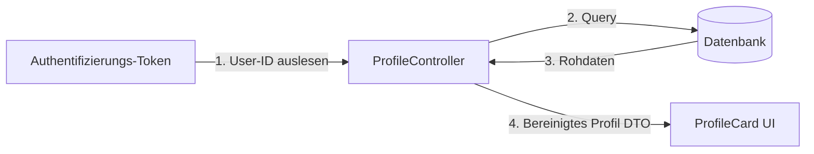

# Profil-Karte (ProfileCard)

Diese Komponente zeigt die Profildetails des angemeldeten Benutzers an.

## C4-Architektur-Ebene
* **C4-Ebene:** Component
* **Deployable:** Nein (Läuft als Teil des Mobile App Containers)

## Datenfluss

