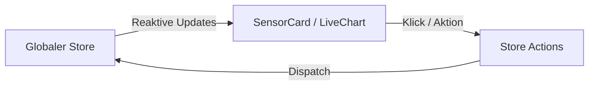

# App Komponenten

Diese Verzeichnis enthält die UI-Komponenten der Mobile-/Web-Anwendung (z.B. Visualisierungen, Charts, Navigation).

## Datenfluss in UI-Komponenten

Die Komponenten erhalten Daten über Props oder den globalen Store und rendern diese reaktiv.

- **LiveChart**: Rendert eintreffende Datenpunkte in Echtzeit.
- **SensorCard**: Zeigt den aktuellen Status und Verbindungszustand von Bluetooth-Geräten.
