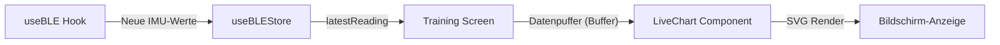

<!--
C4-Ebene: Component
Deployable: Nein
-->

# LiveChart UI-Komponente

Diese Komponente zeichnet eintreffende 6-Achsen-Messwerte der Sensordatenerfassung in Echtzeit auf einem grafischen Canvas.

## C4-Architektur-Ebene
* **C4-Ebene:** Component
* **Deployable:** Nein (Läuft als Teil des Mobile App Containers)

## Beschreibung
Die LiveChart visualisiert den Kurvenverlauf der Beschleunigung (X, Y, Z) und optional des Gyroskops (X, Y, Z) in Echtzeit. Sie erhält kontinuierlich Updates vom BLE-Datenstrom und zeichnet diese flüssig als SVG-Pfade, um eine Latenz unterhalb der Akzeptanzgrenze (NF1) zu garantieren.

## Requirements

**FA1.5.1**: Die App visualisiert die empfangenen Sensordaten und den Übungsfortschritt in Echtzeit.
**FA1.5.2**: Die App visualisiert den Anomalie-Score
**FA1.5.3**: Die App visualisiert die Accuracy

**NF1**: Die End-to-End-Latenz von der physischen Sensorbewegung bis zur visuellen Darstellung in der App muss ≤ 100 ms sein.

## Datenfluss

