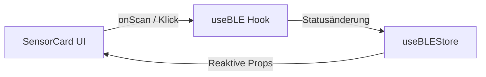

<!--
C4-Ebene: Component
Deployable: Nein
-->

# SensorCard UI-Komponente

Diese Komponente ermöglicht dem Benutzer das Scannen nach MoveLink-Sensoren und das Herstellen/Trennen der Bluetooth-Verbindung.

## C4-Architektur-Ebene
* **C4-Ebene:** Component
* **Deployable:** Nein (Läuft als Teil des Mobile App Containers)

## Beschreibung
Die SensorCard stellt ein gläsernes Benutzeroberflächenelement bereit, das den aktuellen Bluetooth-Verbindungsstatus (getrennt, verbindend, verbunden) anzeigt. Sie steuert den Scanvorgang und erlaubt es, ein aktives Pairing durchzuführen oder zu beenden.

## Requirements

**FA1.2**: Die App ermöglicht das Scannen nach verfügbaren Bluetooth-Sensorgeräten.
**FA1.3**: Die App baut eine stabile Bluetooth-Verbindung zum Sensor auf.
**NF3**: Das Bluetooth-Pairing mit dem Sensor darf maximal zwei manuelle Interaktionen erfordern.

## Datenfluss

