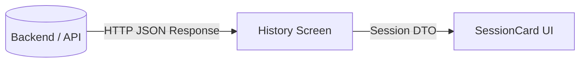

<!--
C4-Ebene: Component
Deployable: Nein
-->

# SessionCard UI-Komponente

Diese Komponente visualisiert die Zusammenfassung und Statistiken einer abgeschlossenen Trainingseinheit.

## C4-Architektur-Ebene
* **C4-Ebene:** Component
* **Deployable:** Nein (Läuft als Teil des Mobile App Containers)

## Beschreibung
Die SessionCard stellt historische Trainingsdaten strukturiert dar, darunter das Datum, die Übungsart (z.B. Bizeps-Curls), die Anzahl der Wiederholungen sowie die durchschnittliche Ausführungsqualität.

## Requirements

**FA1.6**: Die App zeigt historische Trainingseinheiten grafisch und statistisch an.

## Datenfluss

