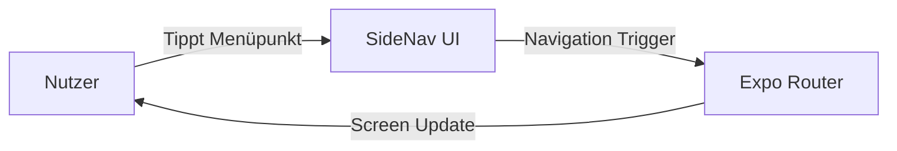

<!--
C4-Ebene: Component
Deployable: Nein
-->

# SideNav UI-Komponente

Diese Navigationskomponente dient als zentrale Steuereinheit auf größeren Displays (Tablets, Web).

## C4-Architektur-Ebene
* **C4-Ebene:** Component
* **Deployable:** Nein (Läuft als Teil des Mobile App Containers)

## Beschreibung
Die SideNav bietet ein einklappbares Seitenmenü zur Navigation zwischen den Tabs (Training, Verlauf, Einstellungen). Sie optimiert die Benutzeroberfläche auf Tablets und Webansichten.

## Requirements

**FA1.1**: Die App bietet eine Navigationsstruktur (Reiter/Menü) für Hardwaregeräte, Trainings und vergangene Einheiten.
**FA1.1.1**: Die App bietet eine Seiten-Navigation (Drawer/SideNav) auf Tablets und Web.

## Datenfluss

