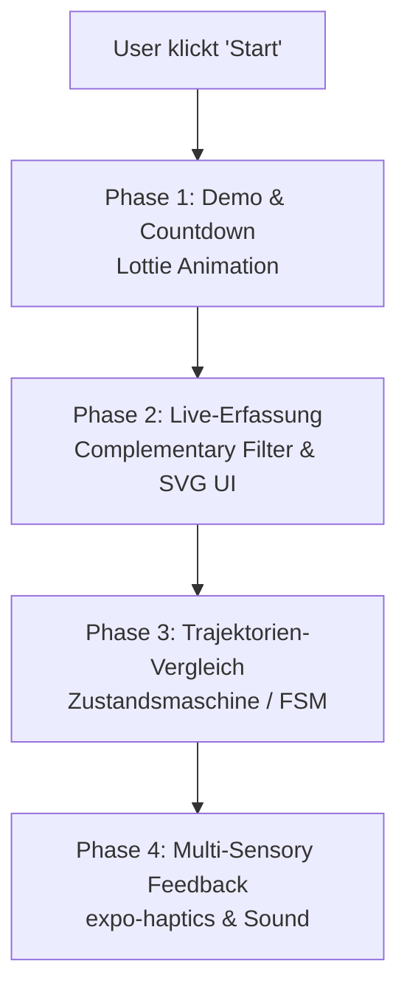
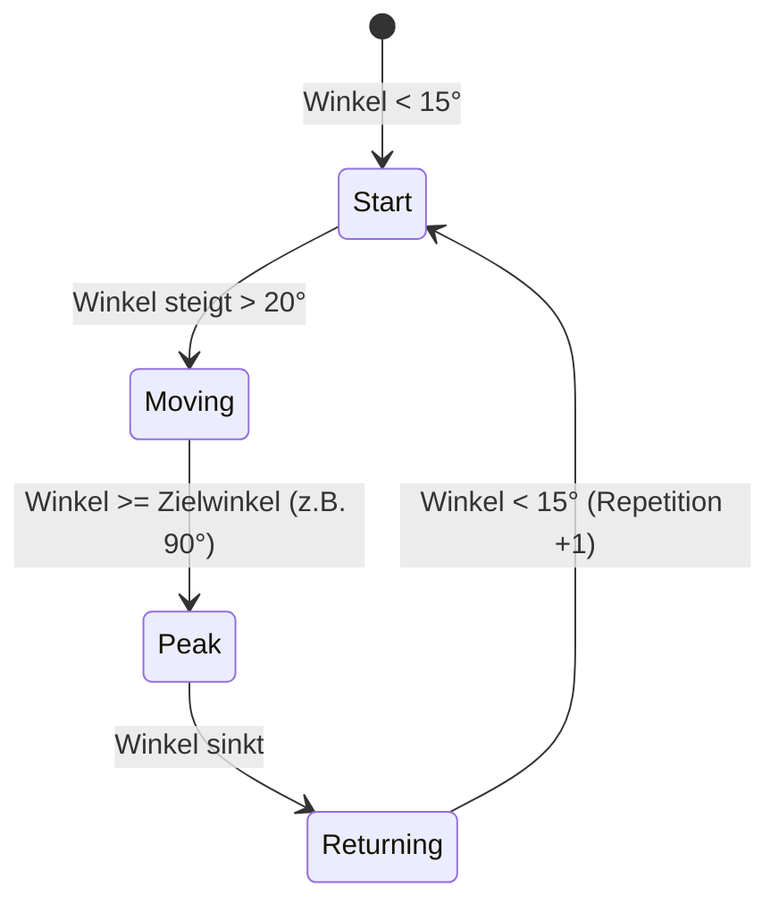

# Architekturentscheidungen: Echtzeit-Training & Bewegungserfassung

Dieses Dokument dokumentiert die Architekturentscheidungen zur Implementierung des interaktiven Trainings-Workflows (Bezug: **UC-2**, Schritte 3 & 4) in der MoveLink Mobile App.

---

## Übersicht der Phasen und Entscheidungen



---

## Phase 1: Grafische Übungsdemonstration

### Entscheidung
Für die grafische Demonstration der Übungsbewegungen werden **Lottie-Animationen (`lottie-react-native`)** verwendet.

### Begründung
* **Performance:** Lottie rendert vektorbasierte JSON-Dateien nativ auf dem Gerät. Dies spart erheblichen Speicherplatz im App-Bundle im Vergleich zu MP4-Videos oder GIF-Dateien und verhindert Ruckeln bei schwächerer Hardware.
* **Flexibilität:** Die Abspielgeschwindigkeit (Cadence) kann programmgesteuert angepasst werden, um sie beispielsweise an das individuelle Tempo des Nutzers anzupassen.
* **Design-Konsistenz:** Vektorgrafiken skalieren ohne Qualitätsverlust auf allen Bildschirmgrößen und passen perfekt zum modernen Dark-Mode/Glassmorphismus-Design der App.

### Ablauf
1. Der Trainierende klickt auf „Start“.
2. Die App wechselt in den Zustand `preparing` und zeigt die Lottie-Loop-Animation der gewählten Übung.
3. Ein 3-sekündiger optischer Countdown wird eingeblendet, um dem Trainierenden Zeit zu geben, sich in Position zu bringen.
4. Nach Ablauf des Countdowns vibriert das Handy kurz, und die BLE-Datenaufzeichnung startet (`isRecording: true`).

---

## Phase 2: Echtzeit-Visualisierung & Sensor-Fusion

### Entscheidung
* **Sensor-Fusion:** Einsatz eines **Komplementärfilters (Complementary Filter)** zur Berechnung der Neigungswinkel aus Beschleunigungssensor und Gyroskop.
* **UI:** Ein dynamischer, glühender **SVG-Progress-Ring** und eine Winkelanzeige visualisieren den Bewegungsfortschritt.

### Begründung
* **Latenz & Drift:** Die rohen Beschleunigungsdaten der IMU (XIAO nRF52840) neigen bei Erschütterungen zu starkem Rauschen, während die integrierten Gyroskopdaten über die Zeit abdriften (Drift). Der Komplementärfilter löst beide Probleme hocheffizient bei minimalem Rechenaufwand:
  $$\theta_{t} = \alpha \cdot (\theta_{t-1} + \omega \cdot \Delta t) + (1 - \alpha) \cdot \theta_{\text{acc}}$$
  *Mit $\alpha = 0.96$, $\omega = \text{Gyroskop-Drehrate}$ und $\theta_{\text{acc}} = \text{Winkel aus Beschleunigungsdaten}$.*
* **Latenz ≤ 100 ms (NF1):** Da der Filter direkt im Frontend auf den eingehenden BLE-Paketen rechnet, entfallen Netzwerk-Latenzen für die Kern-Visualisierung.
* **Aesthetics:** Ein moderner, ringförmiger SVG-Fortschrittsbalken mit weichem Glüh-Effekt (Drop Shadow) fügt sich nahtlos in das restliche UI-Design ein.

---

## Phase 3: Vergleich mit der Zielvorgabe

### Entscheidung
Der Vergleich der Bewegung mit der Zielvorgabe erfolgt über eine **schwellenwertbasierte Zustandsmaschine (Finite State Machine - FSM)** statt rechenintensiver Machine-Learning-Modelle oder DTW auf dem Smartphone.

### Begründung
* **Ressourceneffizienz:** Für Standard-Fitnessübungen (z. B. Kniebeugen, Brizeps-Curls, Schulterdrücken) ist die Bewegung primär durch den Bewegungsumfang (Range of Motion - ROM) auf einer Hauptachse definiert. Eine FSM benötigt minimale Rechenleistung und schont den Akku des Mobilgeräts.
* **Echtzeitfähigkeit:** Auswertungen können ohne spürbare Verzögerungen (sofort nach Erreichen des Zielwinkels) getroffen werden.

### FSM-Zustände


---

## Phase 4: Positives Feedback & Gamification

### Entscheidung
Einbindung eines **Multi-Sensory-Feedback-Systems** bestehend aus:
* **Haptik:** Vibrations-Feedback über `expo-haptics`.
* **Visuals:** Dynamische Farbänderungen der UI und Partikeleffekte bei Erfolg.
* **Audio:** Ein kurzer, angenehmer Benachrichtigungston über `expo-av`.

### Begründung
* **Haptik:** Während des Trainings schaut der Trainierende oft nicht direkt auf den Bildschirm (z. B. bei Kniebeugen). Ein kurzes haptisches Signal beim Erreichen des Peak-Winkels und beim Abschluss der Wiederholung ist daher essenziell für die Usability.
* **Visuelle Belohnung:** Der Fortschrittsring wechselt beim Erreichen des Zielwinkels seine Farbe von Blau/Türkis zu einem leuchtenden Smaragdgrün, um ein sofortiges Erfolgsgefühl zu vermitteln.

---

## Technische Blaupause (TypeScript-Referenz)

Folgender Code skizziert die Realisierung des Tracking-Hooks:

```typescript
import { useState, useRef } from 'react';
import * as Haptics from 'expo-haptics';
import { Audio } from 'expo-av';
import { IMUReading } from '@/store';

export type ExerciseState = 'start' | 'moving' | 'peak' | 'returning';

export function useExerciseTracker(targetAngle = 90) {
  const [angle, setAngle] = useState(0);
  const [reps, setReps] = useState(0);
  const [state, setState] = useState<ExerciseState>('start');
  
  const lastTime = useRef<number>(Date.now());
  const currentAngle = useRef<number>(0);

  const updateMeasurement = async (reading: IMUReading) => {
    const now = Date.now();
    const dt = (now - lastTime.current) / 1000.0;
    lastTime.current = now;

    // 1. Beschleunigungswinkel berechnen (z.B. Pitch)
    const accelAngle = Math.atan2(reading.accelY, reading.accelZ) * (180 / Math.PI);

    // 2. Gyroskop-Integration & Komplementärfilter
    const alpha = 0.96;
    currentAngle.current = alpha * (currentAngle.current + reading.gyroX * dt) + (1 - alpha) * accelAngle;
    
    const absoluteAngle = Math.abs(currentAngle.current);
    setAngle(absoluteAngle);

    // 3. FSM für Wiederholungs- & Peak-Erkennung
    switch (state) {
      case 'start':
        if (absoluteAngle > 20) {
          setState('moving');
        }
        break;
      case 'moving':
        if (absoluteAngle >= targetAngle) {
          setState('peak');
          // Sofortiges haptisches Feedback bei Erfolg
          await Haptics.notificationAsync(Haptics.NotificationFeedbackType.Success);
          // Optionaler Sound
          playSuccessSound();
        }
        break;
      case 'peak':
        if (absoluteAngle < targetAngle - 5) {
          setState('returning');
        }
        break;
      case 'returning':
        if (absoluteAngle < 15) {
          setState('start');
          setReps((r) => r + 1); // Zähler erhöhen
        }
        break;
    }
  };

  const playSuccessSound = async () => {
    const { sound } = await Audio.Sound.createAsync(
      require('@/assets/sounds/success.mp3')
    );
    await sound.playAsync();
  };

  return { angle, reps, state, updateMeasurement };
}
```
