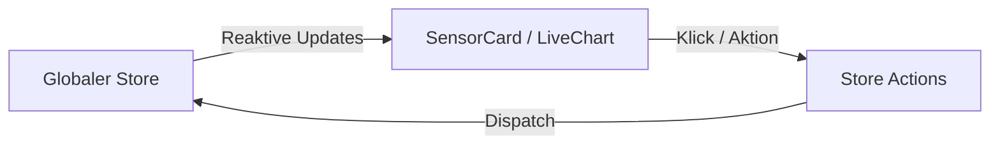
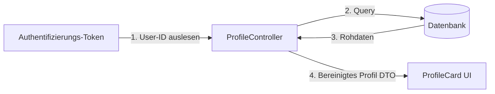
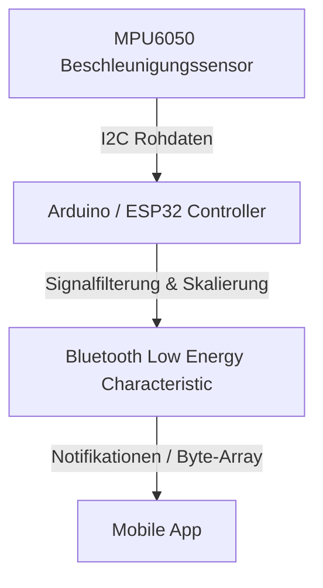

# Systemarchitektur & Datenfluss Dokumentation

*Automatisch generiert am 19.6.2026, 21:31:58*

> Diese Dokumentation wurde automatisch aus den dezentralen `architecture.md` Dateien des Projekts zusammengeführt.

---

## Komponente: components

**Quelle:** [`app\components\architecture.md`](./app/components/architecture.md)

<!-- START COMPONENT DOC -->
# App Komponenten

Diese Verzeichnis enthält die UI-Komponenten der Mobile-/Web-Anwendung (z.B. Visualisierungen, Charts, Navigation).

## Datenfluss in UI-Komponenten

Die Komponenten erhalten Daten über Props oder den globalen Store und rendern diese reaktiv.

- **LiveChart**: Rendert eintreffende Datenpunkte in Echtzeit.
- **SensorCard**: Zeigt den aktuellen Status und Verbindungszustand von Bluetooth-Geräten.
<!-- END COMPONENT DOC -->

---

## Komponente: ProfileCard

**Quelle:** [`app\components\ProfileCard\architecture.md`](./app/components/ProfileCard/architecture.md)

<!-- START COMPONENT DOC -->
# Profil-Karte (ProfileCard)

Diese Komponente zeigt die Profildetails des angemeldeten Benutzers an.

## Datenfluss

<!-- END COMPONENT DOC -->

---

## Komponente: src

**Quelle:** [`embedded\src\architecture.md`](./embedded/src/architecture.md)

<!-- START COMPONENT DOC -->
# Embedded Sensor-Firmware

Die Firmware liest Sensorwerte aus und überträgt diese über Bluetooth Low Energy (BLE) an die App.

## Datenfluss Firmware

- **Sensordatenerfassung**: Erfolgt in einer festen Frequenz (z.B. 50Hz).
- **Filterung**: Tiefpassfilter zur Rauschminderung auf dem Mikrocontroller.
- **BLE-Transfer**: Effiziente Übertragung als binäres Datenpaket.
<!-- END COMPONENT DOC -->

---

