<!--
C4-Ebene: Container
Deployable: Ja
-->

# MoveLink Embedded Firmware - Container-Architektur
# FA2

Dieses Dokument beschreibt die Embedded Sensor-Firmware als eigenständige, deploybare Einheit im C4-Modell.

## C4-Architektur-Ebene
* **C4-Ebene:** Container
* **Deployable:** Ja
* **Deployment-Artefakt:** Binär-Firmware (flashed via USB/Serial)
* **Technologie-Stack:** Arduino C/C++, LSM6DS3 IMU Library, Edge Impulse SDK, Bluetooth Low Energy

## Beschreibung
Die Sensor-Firmware läuft auf dem XIAO nRF52840 Sense Controller. Sie erfasst Beschleunigungs- und Rotationsdaten über den integrierten LSM6DS3-Sensor mit einer festen Abtastrate (50Hz), wendet Signalfilterungen zur Rauschunterdrückung an und streamt die Datenpakete als binäres Array via BLE Characteristics an die Mobile App. Alternativ führt sie Edge-Impulse-Inferenzmodelle direkt auf dem Mikrocontroller aus, um Trainingsübungen (z.B. Bizeps-Curls, Schulterdrücken und Seitheben) lokal zu klassifizieren und Fehler über die integrierten RGB-LEDs anzuzeigen.

## Requirements

**FA2.1**: Das Gerät sammelt die Dreh- und Beschleunigungsdaten des Trainierenden.
**FA2.2**: Das Gerät erkennt, was für eine Bewegung ausgeührt worden ist. 
**FA2.3**: Das Gerät bewertet die Ausführung der Bewegung. 
**FA2.4**: Das Gerät gibt durch die LED den Verbindungsstatus aus.
**FA2.5**: Das Gerät versendet die Daten an die App.
**FA2.6**: Das Gerät ist in einem Gehäuse.

## Komponenten in diesem Container
Die Sensor-Firmware besteht aus folgenden logischen Komponenten:
**FA2.1** -> **[Sensordatenerfassung (Loop)](file:///home/arch/repo/movelink/embedded/src/components/sensordatenerfassung/architecture.md)**: Liest kontinuierlich Beschleunigung (X, Y, Z) und Gyroskop (X, Y, Z).
**FA2.2, FA2.3** -> **[Inferenz-Engine (Edge Impulse)](file:///home/arch/repo/movelink/embedded/src/components/inferenz_engine/architecture.md)**: Klassifiziert Übungsausführungen lokal auf dem Chip.
**FA2.4** -> **[LED- & Display-Controller](file:///home/arch/repo/movelink/embedded/src/components/led_display_controller/architecture.md)**: Bietet direktes visuelles Feedback an den Nutzer bei Fehlern über RGB-LEDs.
**FA2.5** -> **[BLE-Streamer](file:///home/arch/repo/movelink/embedded/src/components/ble_streamer/architecture.md)**: Überträgt die erfassten Daten an den App-Container.
**FA2.6** -> **[Gehäuse](file:///home/arch/repo/movelink/embedded/src/components/gehause/architecture.md)**: Bietet physischen Schutz, sodass das Tragen erleichtert wird.

## Datenfluss

```mermaid
flowchart LR
    %% Stil-Definitionen für Übersichtlichkeit
    classDef hardware fill:#f5f5f5,stroke:#666,stroke-width:2px;
    classDef process fill:#d1e8ff,stroke:#0066cc,stroke-width:1px;
    classDef external fill:#ffe5d9,stroke:#cc3300,stroke-width:1px;

    %% Datenquellen & Hardware
    IMU[("LSM6DS3 Sensor (Hardware)")]:::hardware
    LED[/"RGB-LEDs (Hardware)"/]:::hardware

    %% Interne Komponenten (Prozesse)
    Sensation(Sensordatenerfassung):::process
    Engine(Inferenz-Engine):::process
    LED_Ctrl(LED- & Display-Controller):::process
    BLE_Stream(BLE-Streamer):::process

    %% Externe Senke
    App[[MoveLink Mobile App]]:::external

    %% Datenflussverbindungen mit Datenbeschriftung
    IMU -->|"Rohdaten (IMU X,Y,Z @ 50Hz)"| Sensation
    Sensation -->|"Sensor-Daten-Array (Buffer)"| Engine
    
    %% Aufspaltung nach der Inferenz
    Engine -->|"Klassifizierung & Bewertung"| LED_Ctrl
    Engine -->|"Klassifizierung & Bewertung"| BLE_Stream
    
    %% Ausgaben
    LED_Ctrl -->|"Steuersignal (Anzeige)"| LED
    BLE_Stream -->|"Binäres Array / JSON via BLE"| App
```

## Abwägungen
- **Lokale Auswertung vs. Cloud-Streaming**: Das Ausführen der Inferenz-Engine direkt auf dem Xiao-Controller minimiert die Latenz (NF1) und spart Bandbreite bei der Funkübertragung.
- **Energiebedarf**: Die kontinuierliche Sensordatenerfassung und BLE-Funkübertragung verbrauchen Energie, weshalb die Akkulaufzeit durch einen stromsparenden Betrieb im Idle und Deaktivieren nicht benötigter Hardware-Peripherie optimiert wird.
