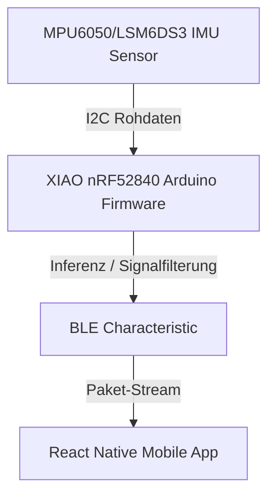

# MoveLink Embedded Firmware - Container-Architektur

Dieses Dokument beschreibt die Embedded Sensor-Firmware als eigenständige, deploybare Einheit im C4-Modell.

## C4-Architektur-Ebene
* **C4-Ebene:** Container
* **Deployable:** Ja
* **Deployment-Artefakt:** Binär-Firmware (flashed via USB/Serial)
* **Technologie-Stack:** Arduino C/C++, LSM6DS3 IMU Library, Edge Impulse SDK, Bluetooth Low Energy

## Beschreibung
Die Sensor-Firmware läuft auf dem XIAO nRF52840 Sense Controller. Sie erfasst Beschleunigungs- und Rotationsdaten über den integrierten LSM6DS3-Sensor mit einer festen Abtastrate (50Hz), wendet Signalfilterungen zur Rauschunterdrückung an und streamt die Datenpakete als binäres Array via BLE Characteristics an die Mobile App. Alternativ führt sie Edge-Impulse-Inferenzmodelle direkt auf dem Mikrocontroller aus, um Trainingsübungen (z.B. Bizeps-Curls) lokal zu klassifizieren und Fehler über die integrierten RGB-LEDs anzuzeigen.

## Komponenten in diesem Container
1. **Sensordatenerfassung (Loop)**: Liest kontinuierlich Beschleunigung (X, Y, Z) und Gyroskop (X, Y, Z). (Erfüllt: FA5)
2. **Inferenz-Engine (Edge Impulse)**: Klassifiziert Übungsausführungen lokal auf dem Chip. (Erfüllt: FA5)
3. **LED- & Display-Controller**: Bietet direktes visuelles Feedback an den Nutzer bei Fehlern. (Erfüllt: FA5)
