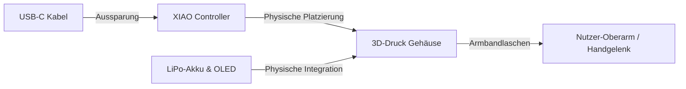

<!--
C4-Ebene: Component
Deployable: Nein
-->

# Gehäuse (Enclosure)

Diese Komponente beschreibt das physische, schützende 3D-Druck-Gehäuse des Sensors.

## C4-Architektur-Ebene
* **C4-Ebene:** Component
* **Deployable:** Nein (Physische Schutzhülle, keine Software-Ausführung)

## Beschreibung
Das Gehäuse umschließt den XIAO-Mikrocontroller sowie die Peripherie (Display, Batterie). Es bietet Befestigungslaschen für ein standardmäßiges 20-mm-Sportarmband, um den Sensor stabil am Arm des Nutzers zu fixieren.

## Requirements

**FA2.6**: Das Gerät ist in einem Gehäuse.
**FA2.6.1**: Schutz der Elektronik vor äußeren Einflüssen.
**FA2.6.2**: Befestigungsmöglichkeit (z.B. Sportarmband) für stabile Fixierung während des Trainings.

## Technische & Physische Parameter
- **Gesamtmaße:** 48 mm (Länge) x 24 mm (Breite) x 16 mm (Höhe)
- **Außenwandstärke:** 2.0 mm
- **Schließmechanismus:** Schnapp-Deckel (Lippe & Snap Bumps mit 0.2 mm Toleranz)
- **Komfort:** Abgerundete Ecken (Bevel-Breite 1.5 mm), um Druckstellen beim Tragen zu vermeiden.
- **Aussparungen:** Integrierter USB-C-Port zur Programmierung und Akku-Ladung.

## Datenfluss

