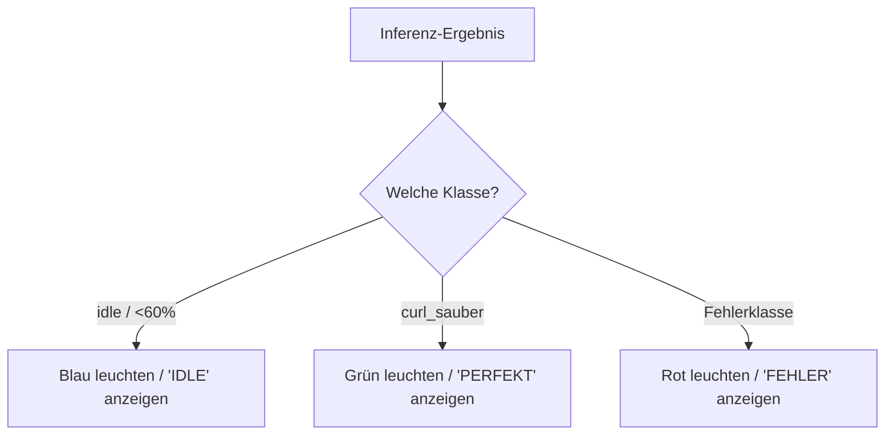

<!--
C4-Ebene: Component
Deployable: Nein
-->

# LED- & Display-Controller

Diese Komponente gibt dem Trainierenden direktes visuelles Feedback zur Qualität der Übungsausführung.

## C4-Architektur-Ebene
* **C4-Ebene:** Component
* **Deployable:** Nein (Läuft als Teil des Sensor Firmware Containers)

## Beschreibung
Der Controller steuert das SSD1306 OLED-Display sowie die integrierten RGB-LEDs des XIAO-Boards basierend auf den Klassifikationsergebnissen der Inferenz-Engine.

### Feedback-Logik
- **Ruhemodus (`idle` oder Konfidenz < 60%):**
  - RGB-LED: **Blau** (Pin 12 auf LOW)
  - Display: Zeigt `Status: IDLE` an.
- **Saubere Ausführung (`curl_sauber`):**
  - RGB-LED: **Grün** (Pin 13 auf LOW)
  - Display: Zeigt `Curl: PERFEKT` an.
- **Fehlerhafte Ausführung (z. B. `fehler_rotation`, `fehler_ellbogen`):**
  - RGB-LED: **Rot** (Pin 11 auf LOW)
  - Display: Zeigt `Achtung: FEHLER` an.

## Implementierung & Traceability
- **Implementiert in:** [Executable.ino](file:///c:/Users/erlin/repo/movelink/embedded/src/Executable.ino) (unter Verwendung der U8x8-Bibliothek)
- **Erfüllt Anforderungen:**
  - **FA9: Biofeedback und Auswertung**: Ermöglicht sofortiges visuelles Biofeedback direkt an der Sensor-Hardware.

## Kontrollfluss

