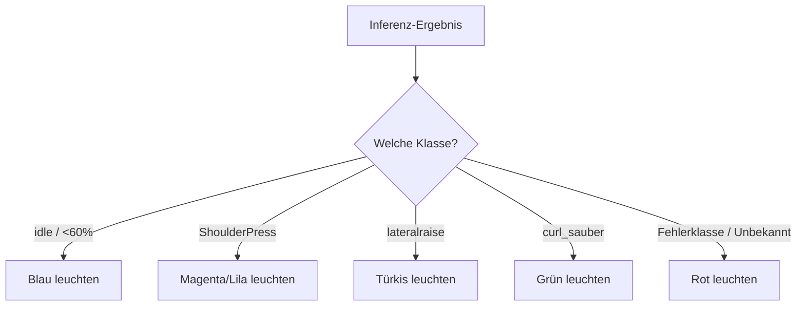

<!--
C4-Ebene: Component
Deployable: Nein
fullfills: FA2.4
-->

# LED- & Display-Controller

Diese Komponente gibt dem Trainierenden direktes visuelles Feedback zur Qualität und dem Typ der Übungsausführung über die integrierte RGB-LED.

## C4-Architektur-Ebene
* **C4-Ebene:** Component
* **Deployable:** Nein (Läuft als Teil des Sensor Firmware Containers)

## Beschreibung
Der Controller steuert die integrierten Low-Active RGB-LEDs des XIAO-Boards (Pins `LEDR`, `LEDB` und `LEDG`) basierend auf den Klassifikationsergebnissen der Inferenz-Engine. Das ursprüngliche OLED-Display (U8x8) wurde aus Designgründen entfernt, um Gewicht und Energiebedarf einzusparen.

### Feedback-Logik
- **Warte auf Bluetooth-Verbindung (kein BLE verbunden):**
  - RGB-LED: **Langsames Blinken (Blau)** (Pin `LEDB` blinkt an/aus)
- **Ruhemodus (`idle` oder Konfidenz < 60%):**
  - RGB-LED: **Blau** (Pin `LEDB` auf LOW)
- **Schulterdrücken (`ShoulderPress`):**
  - RGB-LED: **Magenta/Lila** (Pins `LEDR` und `LEDB` auf LOW)
- **Seitheben (`lateralraise` / `LateralRaise` / `LateralRaises`):**
  - RGB-LED: **Türkis** (Pins `LEDB` und `LEDG` auf LOW)
- **Saubere Ausführung Bizeps-Curl (`curl` / `curl_sauber`):**
  - RGB-LED: **Grün** (Pin `LEDG` auf LOW)
- **Fehlerhafte Ausführung / Sonstiges (z. B. `fehler_rotation`, `fehler_ellbogen`):**
  - RGB-LED: **Rot** (Pin `LEDR` auf LOW)

## Requirements

**FA2.4**: Das Gerät gibt durch die LED den Verbindungsstatus aus.
**FA2.4.1**: Ansteuerung der RGB-LED zur Signalisierung von Fehlern (Rot), perfekten Curls (Grün), Seitheben (Türkis), Schulterdrücken (Lila) und Idle/Verbindungsaufbau (Blau).

## Kontrollfluss

