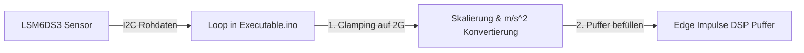

<!--
C4-Ebene: Component
Deployable: Nein
-->

# Sensordatenerfassung (Loop)

Diese Komponente liest kontinuierlich die Rohwerte des Beschleunigungssensors und Gyroskops aus.

## C4-Architektur-Ebene
* **C4-Ebene:** Component
* **Deployable:** Nein (Läuft als Teil des Sensor Firmware Containers)

## Beschreibung
Die Sensordatenerfassung liest in einer festen Schleife (Loop) die 6-Achsen-IMU-Werte (Beschleunigung und Drehung) des LSM6DS3-Sensors über den I2C-Bus ein.

### Technische Details
- **Abtastrate:** 50 Hz (gesteuert durch präzises Timing in Microsekunden)
- **Signal-Clamping:** Beschleunigungswerte werden auf max. ±2.0 G gedämpft/geclampt.
- **Konvertierung:** Die Werte werden in die SI-Einheit $m/s^2$ konvertiert ($1\,G = 9.80665\,m/s^2$).
- **Verwendete Hardware:** LSM6DS3 IMU auf dem XIAO nRF52840 Sense.

## Implementierung & Traceability
- **Implementiert in:** [Executable.ino](file:///c:/Users/erlin/repo/movelink/embedded/src/Executable.ino)
- **Erfüllt Anforderungen:**
  - **FA5: Datenstrom-Verarbeitung**: Die Sensordaten werden kontinuierlich erfasst und für die Klassifikation aufbereitet.
  - **NF1: Latenz**: Durch die hardwarenahe I2C-Abfrage und das Vermeiden von blockierenden Delays wird eine niedrige E2E-Latenz ermöglicht.

## Datenfluss

