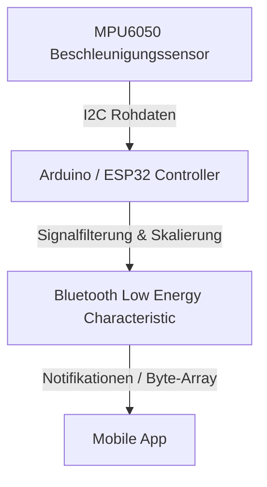

# Embedded Sensor-Firmware

Die Firmware liest Sensorwerte aus und überträgt diese über Bluetooth Low Energy (BLE) an die App.

## Datenfluss Firmware

- **Sensordatenerfassung**: Erfolgt in einer festen Frequenz (z.B. 50Hz).
- **Filterung**: Tiefpassfilter zur Rauschminderung auf dem Mikrocontroller.
- **BLE-Transfer**: Effiziente Übertragung als binäres Datenpaket.
