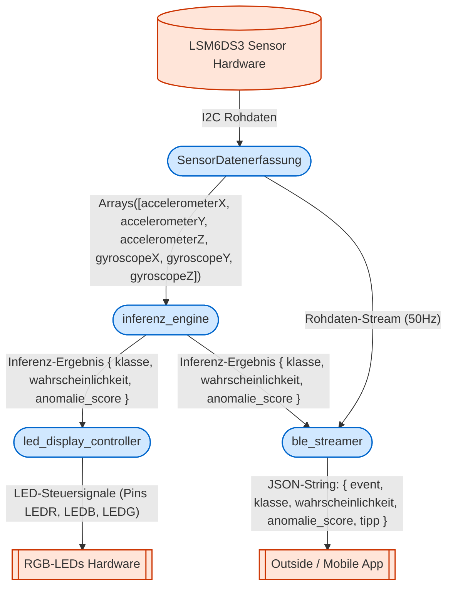

<!--
C4-Ebene: Container
Deployable: Ja
-->

# Embedded Sensor-Firmware - Quellcode-Architektur

Dieses Dokument beschreibt die interne Komponentenstruktur und den Datenfluss innerhalb des `src`-Verzeichnisses der MoveLink Embedded Firmware.

## C4-Architektur

Die Firmware ist in vier Kernkomponenten aufgeteilt, die über klar definierte Schnittstellen miteinander kommunizieren.

### Komponenten (Components)

1. **SensorDatenerfassung (IMUReader)**:
   - Erfasst periodisch (50Hz) die 3-Achsen-Beschleunigung und 3-Achsen-Rotationsrate über den LSM6DS3-Sensor per I2C.
   - Pufferung der Daten zur Weitergabe an die Inferenz-Engine.

2. **inferenz_engine (InferenceEngine)**:
   - Führt das Edge Impulse CNN-Modell lokal auf dem Mikrocontroller aus.
   - Nimmt den Sensor-Datenpuffer entgegen und berechnet Klasse (Übungstyp/Qualität), Wahrscheinlichkeit (Konfidenz) und Anomalie-Score.

3. **led_display_controller (VisualFeedback)**:
   - Verarbeitet das Inferenz-Ergebnis und steuert die RGB-LEDs zur direkten Nutzersignalisierung an.

4. **ble_streamer (BLEStreamer)**:
   - Verwaltet den Bluetooth Low Energy Stack und überträgt sowohl die Rohbewegungsdaten als auch die klassifizierten Trainingsergebnisse.

---

### Datenfluss-Definitionen

* **SensorDatenerfassung &rarr; inferenz_engine**:
  - `Arrays([accelerometerX, accelerometerY, accelerometerZ, gyroscopeX, gyroscopeY, gyroscopeZ])`

* **inferenz_engine &rarr; led_display_controller / ble_streamer**:
  - `{ klasse: String, wahrscheinlichkeit: float, anomalie_score: float }`

* **ble_streamer &rarr; Outside (Mobile App / Serial)**:
  - `Json ({"event": "inferenz_ergebnis", "klasse": "LateralRaises", "wahrscheinlichkeit": 0.824, "anomalie_score": 4.515, "tipp": "Warte auf Bluetooth-Verbindung..."})`