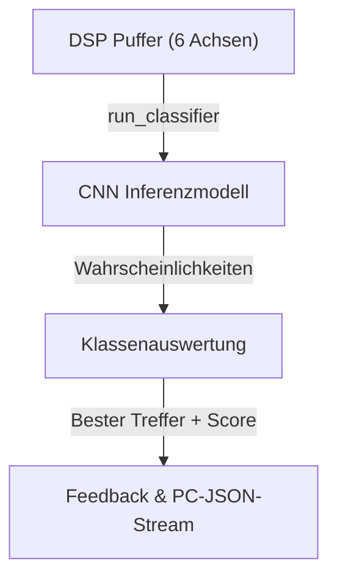

<!--
C4-Ebene: Component
Deployable: Nein
-->

# Inferenz-Engine (Edge Impulse)

Diese Komponente klassifiziert Übungsausführungen in Echtzeit direkt auf dem Mikrocontroller (Edge Computing).

## C4-Architektur-Ebene
* **C4-Ebene:** Component
* **Deployable:** Nein (Läuft als Teil des Sensor Firmware Containers)

## Beschreibung
Die Inferenz-Engine führt ein CNN-Klassifikationsmodell aus, das über Edge Impulse trainiert und als Arduino-Bibliothek in die Firmware integriert wurde. Es analysiert die 6-Achsen-Bewegungsdaten auf spezifische Übungsqualitäten und Fehlerbilder.

## Requirements

**FA2.2**: Das Gerät erkennt, was für eine Bewegung ausgeführt worden ist.
**FA2.3**: Das Gerät bewertet die Ausführung der Bewegung.

**FA2.2.1**: Das Gerät erkennt einen Idle Modus
**FA2.2.2**: Das Gerät erkennt einen Curl
**FA2.2.3**: Das Gerät erkennt einen shoulder press
**FA2.2.4**: Das Gerät erkennt einen Lateral raise
**FA2.2.5**: Das Gerät erkennt eine tricep extension

## Datenfluss

## Technische Details
- **Modelltyp:** Convolutional Neural Network (CNN)
- **Erkannte Klassen:**
  - `idle` / `Idle`: Keine Übungsausführung / Ruhezustand.
  - `curl` / `curl_sauber` / `CURL`: Korrekt ausgeführter Bizeps-Curl.
  - `ShoulderPress` / `shoulderpress`: Schulterdrücken.
  - `lateralraise` / `LateralRaise` / `LateralRaises`: Seitheben.
  - `fehler_rotation`: Fehlerhafte Ausführung des Bizeps-Curls durch Rotation des Handgelenks.
  - `fehler_ellbogen`: Fehlerhafte Ausführung des Bizeps-Curls durch Bewegung des Ellbogens.
- **Anomalieerkennung:** Optionaler K-Means-Clustering-Block zur Erkennung unbekannter Bewegungen.
